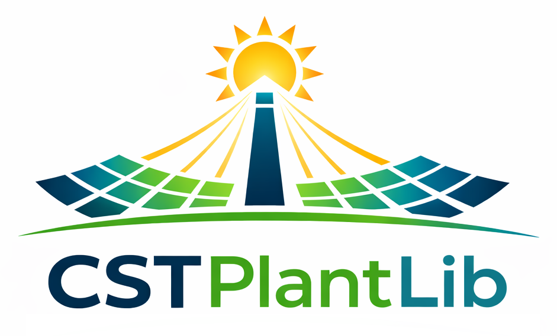

  

# Concentrating Solar Thermal Plant Library

A Python framework developed at the _Concentrating Solar Thermal Technologies Unit_ of _CIEMAT-PSA_ for modular simulation of concentrating solar thermal power plants and solar heat applications for industrial processes.

## Key Features

- Object-oriented design with modular and extensible architecture.
- Fast and accurate quasi-dynamic simulations with time steps of minutes or seconds.
- Line-focus concentrating collectors: parabolic troughs and linear Fresnel reflectors.
- Solar fields with non-homogeneous layouts including different collector loops and orientations.
- Central receiver systems: heliostat fields characterized by efficiency maps and attenuation vectors.
- Industrial processes based on steam or liquid media with typical or customized demand profiles.
- Thermal energy storage systems: double- and single-tank systems, variable volume tanks, stratified...
- Simplified power block model based on steam Rankine cycles, including start-up and part-load behaviour.

## Note

This library is under development.
